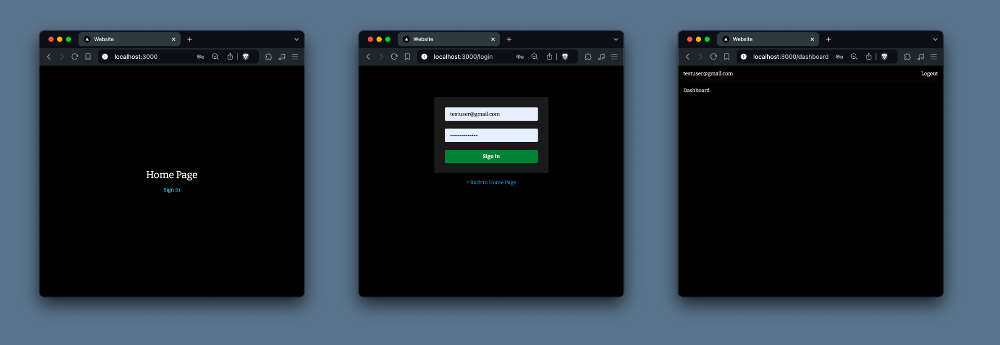

# Next.js Supabase Auth Starter
### Minimal version of the supabase auth next js starter without signup. Intended for creating a quick authenticated admin area for a next project.


## Local Setup

1. Install dependencies:
   ```
   pnpm i
   ```

2. Save `.env.local.example` as `.env.local` file in the root directory and add your Supabase credentials:
   ```
   NEXT_PUBLIC_SUPABASE_URL=YOUR_SUPABASE_URL
   NEXT_PUBLIC_SUPABASE_ANON_KEY=YOUR_SUPABASE_ANON_KEY
   ```
   

3. Run 
   ```
   pnpm run dev
   ```